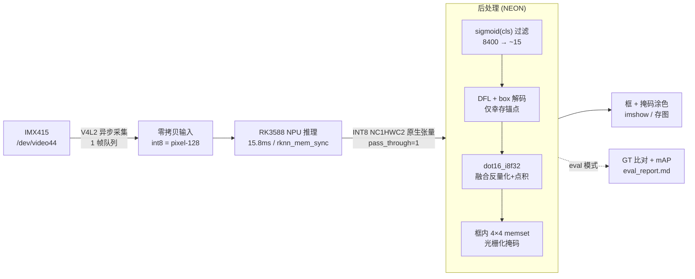
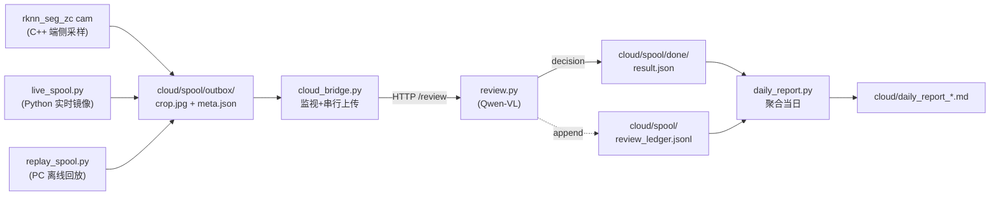

# YOLOv8-seg 裂缝实例分割 · RK3588 NPU 零拷贝端侧部署

> YOLOv8-seg（32 通道掩码系数 + 原型掩码）单类裂缝实例分割，从训练到 RK3588 板端 INT8 部署的全流程工程。
> 通过 ONNX 图手术（cut-tail）解决 INT8 量化置信度全零，用 RKNN C API 零拷贝 + ARM NEON + filter-first 把推理-后处理压到 NPU 主导（占端到端 96.7%）。

| 指标 | 值 | 说明 |
|---|---|---|
| **NPU 推理** | **15.8 ms** | `RKNN_QUERY_PERF_RUN` 真实 NPU 计算时间 |
| **处理端到端** | **61.2 FPS**（16.3 ms/帧） | run + 后处理 + 拷贝 + sync（不含 letterbox），视频文件源 |
| **相机实时** | **30.0 FPS** | IMX415 ISP 硬件节拍上限（相机而非推理是天花板） |
| **模型大小** | **4.5 MB** | INT8 cut-tail（原 ONNX 13 MB） |
| **板端 Box mAP50** | **0.809** | 200 val 图，C++ eval 模式 |
| **板端 Mask mAP50** | **0.626**（C++ 实时）/ **0.669**（160 口径 ≈ 训练机 0.666） | 不同口径对照见 [局限](#五局限与诚实声明)，非单独隔离量化影响 |
| 训练机参考 | Box 0.833 / Mask 0.666 | best.pt FP32，ultralytics val |

> 详细性能归因见 [`研究报告_YOLOv8-seg_RK3588零拷贝优化.md`](研究报告_YOLOv8-seg_RK3588零拷贝优化.md)；板端精度对齐见 [`eval_results/ALIGNMENT_NOTES.md`](eval_results/ALIGNMENT_NOTES.md)。

---

## 效果展示

> `rknn_seg_zc demo` 模式（S4）：视频文件 / 图像目录 → 零拷贝推理 + filter-first 后处理 → 框 + 4×4 掩码涂色 + OSD → 写 mp4/gif。**刻意避开相机 30 FPS 节拍**，展示真实处理吞吐。

**实测演示**（50 张裂缝图像目录 → `demo_imgs.mp4`，再做 `demo_small.gif`）：


> 平均置信度 **0.785**，处理吞吐 **60.2 FPS**（OSD 实时显示）。GIF 80 帧 / 10s / 1.9 MB。

**端到端吞吐对比**（Python 基线 → C++ 零拷贝，视频文件源无相机节拍）：


| 阶段 | 推理 | 后处理 | 端到端 | FPS | 备注 |
|---|---|---|---|---|---|
| Python 参考基线（`RKNNLite`） | 24.9 ms | 9.1 ms | 34.0 ms | **29.4** | numpy↔NPU 拷贝 + 自动反量化 |
| C++ 零拷贝（schedutil 调速器） | ~19 ms | 0.6 ms | ~22.8 ms | **43.0** | 零拷贝 + filter-first，调速器未锁频 |
| **C++ 零拷贝（performance 调速器）** | **15.8 ms** | **0.6 ms** | **16.3 ms** | **61.2** | 8 核锁 performance，`CORE_0` 单核，NPU 运行于 1 GHz |
| 相机实时墙钟 | — | — | 33.3 ms | **30.0** | IMX415 ISP 硬件节拍上限（非推理瓶颈） |

**2.08× 提升**（29.4 → 61.2 FPS）。NPU 推理占端到端 96.7%，软件开销 <0.6 ms，处理链路主要耗时位于 NPU 执行阶段（单核 `CORE_0`，1 GHz）。**相机实时仍 30 FPS**：这是 IMX415 硬件节拍，不是推理瓶颈——视频文件源展示的是真实处理吞吐。数据见研究报告 L303-306，如实未改。

**YOLO11 检测 vs YOLOv8-seg 分割**（同口径 Python `RKNNLite` bench，300 帧 `/oem/SampleVideo_1280x720_5mb.mp4`，8 核 performance，`NPU_CORE_0_1_2`）：

![YOLO 检测 vs 分割 FPS]

| 模型 | 任务 | NPU 计算 | 后处理 | 端到端 | FPS |
|---|---|---|---|---|---|
| YOLO11 INT8（4.25 MB） | COCO 80 类检测 | 16.8 ms | 2.9 ms | 24.5 ms | **27.3** |
| YOLOv8-seg INT8（4.55 MB） | crack 单类分割 | 15.4 ms | 8.2 ms | 31.3 ms | **22.7** |
| YOLOv8-seg FP16（7.99 MB） | crack 单类分割 | 31.0 ms | 7.8 ms | 60.2 ms | **13.8** |

> 检测比分割快 1.20×（27.3 vs 22.7 FPS）：两者 NPU 计算相近（16.8 vs 15.4 ms），差距主要来自分割多出的掩码系数(32ch)与原型掩码(32×160×160)后处理（8.2 vs 2.9 ms）。FP16 推理为 INT8 的 0.44× 速度。三模型 NPU 均锁 1 GHz、温度峰值 ≤36.1 °C，无热降频。**非精度/性价比排名**——任务复杂度(80 类 vs 单类、有无掩码)、模型结构、量化精度三因素未单独隔离。全指标见 [`eval_results/yolo_vs_seg/对比报告.md`](eval_results/yolo_vs_seg/对比报告.md)。

**延迟分布与 10 分钟热稳定性**（36000 帧持续推理，≈10 min，performance 调速器）：

| 指标 | mean | p50 | p95 | p99 | max |
|---|---|---|---|---|---|
| NPU run（`PERF_RUN`） | 15.9 ms | 15.9 ms | 16.0 ms | 16.8 ms | 17.3 ms |
| 端到端（run+后处理+拷贝+sync） | 16.3 ms | 16.2 ms | 16.6 ms | 17.8 ms | 18.3 ms |

> p50/p95 为程序对全部 36000 帧的统计；p99/max 取自每 10 帧一条的日志样本（3557 条）。

- **主体分布集中，但非“无长尾”**：端到端 p95=16.6 ms（较 mean +0.3 / 较 p50 +0.4），p99=17.8 ms，max=18.3 ms。超过 17 ms 的帧占 3.6%、超过 18 ms 占 0.11%（4 帧），无帧超 20 ms。约 1800 帧落在 p95 以上属正常分布尾部，未见持续劣化的长尾。
- **频率：采样级证据，非逐帧证明**：约 10 min 内 120 个采样点（每 5 s）均记录 NPU 频率 1 GHz。5 s 采样不能覆盖逐帧频率瞬变，结论收紧为“采样点未观察到频率下降 + 逐帧延迟 p99 与 p50 仅差 1.6 ms、无持续抬升”，二者交叉支持频率稳定，但不等价于“无一帧跌频”。
- **温度远低于固件临界点**（阈值取自板卡固件热管理配置，非泛化估计）：NPU 热区 32.4 → 峰值 37.9 → 末值 37.0 °C，全部热区峰值 ≤39.8 °C（little 核最高）；`npu-thermal` 临界点 **115 °C（critical）**，`soc-thermal` 75/85 °C（passive），本次负载远低于两者。
- **测试配置**：ATK-DLRK3588（RK3588 evb7-lp4-v10），被动散热（无风扇），环境温度约 25 °C（由空载传感器 ~33 °C 反推），8 核 performance 调速器，`CORE_0` 单核，输入 640×640 letterbox，batch=1，视频文件源循环输入。
- 原始数据：[`eval_results/bench_10min.log`](eval_results/bench_10min.log)（36000 帧日志 + 总结）、[`eval_results/thermal_10min.csv`](eval_results/thermal_10min.csv)（120 样本 npufreq + 7 热区）。

---

## 一、效果定位

一句话：**把 YOLOv8-seg 在 RK3588 上的推理-后处理路径优化至主要耗时位于 NPU 执行阶段（NPU 占端到端 96.7%），精度与 Python 参考对齐，为端侧视觉感知提供高吞吐、低延迟、零拷贝前端。**

三个关键数字：

- **15.8 ms** —— NPU 推理占端到端 96.7%，软件开销 <0.6 ms；在当前模型/输入/单核配置下，处理链路主要耗时位于 NPU 执行阶段。
- **61 FPS** —— 视频文件源端到端处理吞吐；相机实时 30 FPS 是 IMX415 硬件节拍上限，不是推理瓶颈。
- **0.809 / 0.626** —— 板端 INT8 mAP，与训练机 0.833/0.666 对照（Box −2.4 个百分点；Mask 多口径接近，C++ 实时 −4.0 个百分点，归因于 4×4 光栅化，未单独隔离量化影响）。

---

## 二、架构图



ASCII 版（无 mermaid 渲染时）：

```
IMX415 →[V4L2 async]→ 零拷贝输入(int8=pixel-128)
                           │
                           ▼
          RK3588 NPU 推理 15.8ms (rknn_create_mem/set_io_mem/mem_sync)
                           │  INT8 NC1HWC2 原生张量, pass_through=1
                           ▼
   filter-first 后处理 0.6ms ──┬── sigmoid(cls) 过滤 8400→~15
                               ├── DFL + box 解码 (仅幸存锚点)
                               ├── dot16_i8f32 (融合 int8×float32 点积, 省 proto 全量反量化)
                               └── 框内 4×4 memset 光栅化 (省 cv2.resize)
                           │
                           ▼
                  框 + 掩码涂色 → imshow / 存图
                           └─ eval 模式 → GT 比对 → mAP → eval_report.md
```

优化链路（每条都是"问题 → 手段 → 结果"）：

1. **ONNX cut-tail 图手术** —— INT8 把 DFL/Sigmoid/decode 量化塌掉致置信度全零 → 删 31 个尾部敏感算子、10 个原始 Conv 分支输出 → INT8 只碰 Conv → "INT8 速度 + FP32 精度"。额外修复：cut 导出漏了 proto SiLU，手动补回 Sigmoid+Mul（详见 [ALIGNMENT_NOTES](eval_results/ALIGNMENT_NOTES.md)）。
2. **零拷贝原生张量** —— `rknn.inference()` 的 numpy↔NPU 拷贝 + 自动反量化慢 → `rknn_create_mem/set_io_mem/mem_sync` + `pass_through=1` 直接吃 NPU 原生 int8 → 推理 24.9→16.0 ms。
3. **NEON 融合点积 `dot16_i8f32`** —— proto 全量反量化浪费 → 直接吃原生 int8 proto，反量化融进点积累加（C2=16 连续，一次 `vld1_s8`）→ 省全量反量化。
4. **filter-first** —— 8400 锚点全算 DFL（每锚点 64 次 softmax）是浪费 → 先 sigmoid(cls) 过滤到 ~15 个幸存锚点再重活 → DFL 工作量降 ~560×。掩码合成跳过 sigmoid（`sigmoid(x)>0.5 ⟺ x>0`）。
5. **框内 4×4 memset 光栅化** —— 160→640 双线性 `cv2.resize` 慢 → 框内直接 4×4 块 memset → 省中间 Mat + resize，后处理 9.1→0.6 ms。
6. **CPU performance 调速器** —— schedutil 抖动 → 8 核全设 performance → NPU run ~19→15.8 ms（最廉价单一优化）。

---

## 三、环境与依赖

### 硬件

- **板端**：RK3588（3 核 NPU @ 1 GHz，8 GB 内存），IMX415 摄像头（`/dev/video44`）
- **训练机**：Windows + NVIDIA GPU（仅训练，非部署）

### 板端运行依赖

| 依赖 | 版本 | 说明 |
|---|---|---|
| librknnrt.so | RKNN Toolkit2 runtime | 板端 NPU C API，sysroot 自带 |
| OpenCV | 4.9.0 | highgui/imgcodecs/imgproc/videoio/core |
| RKNNLite (Python) | 板端自带 | 仅 Python 参考/eval 路径用 |
| Python | 3.11 | 板端自带（仅 `eval_py.py` / `vtes_cut.py`） |

### 交叉编译工具链

- **buildroot aarch64 g++ 13.4.0**：`atk_dlrk3588_linux6.1/buildroot/output/alientek_rk3588/host/bin/aarch64-buildroot-linux-gnu-g++`
- **sysroot**：含 librknnrt.so + opencv4 头/库
- 见 [`build_zc.sh`](build_zc.sh)

### 模型转换工具链（PC 侧）

- **rknn-toolkit2 v2.3.2**（conda env `rknn2`，`anaconda3/envs/rknn2/bin/python3`）
  - ⚠️ **必须用 `rknn2` 环境**。`pytorch` 环境（toolkit v1.5.2）对 cut-tail ONNX 会触发 `onnxoptimizer` segfault。
- **onnxruntime 1.19.2**（host FP32 参考验证用）
- **ultralytics**（训练 + val 参考）

---

## 四、一键复现

### 1. 交叉编译 C++ 推理程序

```bash
cd /yolo8-seg
bash build_zc.sh          # 产出 aarch64 ELF: rknn_seg_zc
```

### 2. 部署到板端（adb 已连接）

```bash
adb push rknn_seg_zc            /yolo8/
adb push yolo8n_int8_cut.rknn   /yolo8/
adb push post_cut.py            /yolo8/    # Python 参考/eval 用
adb push eval_py.py             /yolo8/
```

### 3. 板端运行（先设 performance 调速器）

```bash
# 8 核全设 performance (NPU run ~19→15.8ms, 最廉价优化)
for i in 0 1 2 3 4 5 6 7; do
  adb shell "echo performance > /sys/devices/system/cpu/cpu$i/cpufreq/scaling_governor"
done

adb shell
cd /yolo8
export LD_LIBRARY_PATH=/usr/lib:$LD_LIBRARY_PATH

# 静态图推理 (精度回归)
./rknn_seg_zc image yolo8n_int8_cut.rknn test_frame.png

# 相机实时显示
./rknn_seg_zc cam   yolo8n_int8_cut.rknn /dev/video44

# 相机 benchmark (300 帧)
./rknn_seg_zc bench yolo8n_int8_cut.rknn /dev/video44 300

# 视频吞吐 (无相机节拍, 展示真实 61 FPS)
./rknn_seg_zc bench yolo8n_int8_cut.rknn /oem/SampleVideo_1280x720_5mb.mp4 300

# demo 生成可视化 (视频文件或图像目录 → 涂色+OSD mp4, 避开相机节拍展示真实处理 FPS)
./rknn_seg_zc demo  yolo8n_int8_cut.rknn /oem/SampleVideo_1280x720_5mb.mp4 demo_video.mp4
./rknn_seg_zc demo  yolo8n_int8_cut.rknn datasets/crack-seg/images/val    demo_imgs.mp4

# 板端 mAP 评测 (eval 模式, 需 datasets/crack-seg)
./rknn_seg_zc eval  yolo8n_int8_cut.rknn /path/to/crack-seg val
#   → 生成 eval_report.md (Box/Mask mAP50/mAP50-95/recall/miss/IoU + 失败样例)

# Python 双线性参考 (隔离 4×4 光栅化对 mask mAP 的影响)
python3 eval_py.py yolo8n_int8_cut.rknn /path/to/crack-seg val
```

`rknn_seg_zc` 模式总览：

| 模式 | 命令 | 用途 |
|---|---|---|
| `image` | `image <model> ` | 单图推理 + 可视化，精度回归 |
| `cam` | `cam <model> [src]` | 相机实时显示，默认 `/dev/video44` |
| `bench` | `bench <model> [src] [N]` | N 帧基准，打印推理/后处理/FPS |
| `demo` | `demo <model> <video_or_dir> [out.mp4]` | 视频文件/图像目录 → 零拷贝推理 + 涂色 + OSD → mp4，避开相机节拍展示真实吞吐（S4） |
| `eval` | `eval <model> <dataset_dir> [split]` | val 集 mAP 评测，生成 `eval_report.md` |

环境变量：`CORE_MASK=0|1|3|7|0xffff` 覆盖 NPU 核心掩码（默认 `CORE_0`，小模型单核已饱和）；`EVAL_DEBUG=1` 打印 eval 逐图调试。

### 4. 模型转换（从 ONNX 重建 .rknn，可选）

```bash
# 用 rknn2 环境 (不是 pytorch!)
/anaconda3/envs/rknn2/bin/python3 convert_cut.py
#   读 yolo8n_cut.onnx → INT8 量化 (50 张校准图 quant.txt) → yolo8n_int8_cut.rknn
```

---

## 五、局限与诚实声明

**如实报告，未为好看调数字。**

1. **相机 30 FPS 是真天花板，不是推理瓶颈。** 用 `RKNN_QUERY_PERF_RUN` 分离出 NPU 计算 15.77 ms、软件开销 <0.6 ms（NPU 占端到端 96.7%），处理链路主要耗时位于 NPU 执行阶段。墙钟 FPS 受 IMX415 ISP 30 FPS 节拍限制（见 [`cam-imx415-30fps-hardlimit` 记忆]）。视频文件源可跑到 61 FPS 展示真实吞吐。**10 分钟 / 36000 帧持续推理验证**：120 个频率采样点（每 5 s）均记录 1 GHz，逐帧延迟 p99=17.8 ms / max=18.3 ms 无持续抬升；NPU 热区峰值 37.9 °C 远低于固件临界点 115 °C（详见 [效果展示](#效果展示) 延迟/热稳定表与 [`eval_results/`](eval_results/)）。注意：5 s 采样覆盖采样点而非逐帧，结论由采样 + 逐帧延迟分布交叉支持。

2. **单类（crack）。** cls 通道=1 硬编码，`rknn_seg_zc.cpp` 多类路径已预留但未启用。单类 demo 对简历/验证完全够；多类需重训 + 改后处理。

3. **Mask mAP 的 4×4 光栅化折中。** C++ 实时路径用框内 4×4 块 memset（最近邻）+ 416 分辨率 IoU 换取相机实时路径的实时性，Mask mAP50 = 0.626 vs 训练机 0.666（−4.0 个百分点）。多口径接近不能单独隔离 INT8 量化的影响——分辨率、插值、评测实现均不同；这里只能观察到“同 INT8 模型在不同口径下结果接近”，更多口径对照见 [`eval_results/ALIGNMENT_NOTES.md`](eval_results/ALIGNMENT_NOTES.md)。

4. **Box mAP −2.4 个百分点（0.833→0.809）= INT8 量化预期代价。** cut-tail 已把 DFL/Sigmoid/box 解码移出量化图（仅 Conv 量化），影响小但非零。

5. **训练轻微过拟合。** Box/Mask mAP 峰值在 epoch 84-90，之后波动下行至 184（patience=100 早停触发）。`best.pt` 保存峰值权重。这是 YOLOv8n-seg 小模型 + 细长裂缝的典型上限，非实现错误。

---

## 六、云端 VLM 复核（灰区二次判定，可选增值）

> **定位**：端侧 INT8 分割对低置信**灰区** `[OBJ_THRESH=0.18, CLOUD_HI=0.45)` 的检测框采样上传，云端 Qwen-VL 复核，回写 `upgrade`/`downgrade`/`human_queue`/`keep_edge` 决策，`daily_report` 聚合。**这是端侧主流程之上的可选纵向增值，非本项目核心交付**——端侧分割推理链路（见二/四节）独立成立，不依赖云端。

### 数据流



### 文件清单（`cloud/` 子目录）

| 文件 | 作用 |
|---|---|
| [`cloud/live_spool.py`](cloud/live_spool.py) | 板端相机实时灰区采样，`rknn_seg_zc.cpp::cloud_sample` 的 Python 镜像（RKNNLite + `post_cut.post_process`） |
| [`cloud/replay_spool.py`](cloud/replay_spool.py) | PC 离线用 `best.pt` 跑 val 集模拟灰区采样，无板子时打通云端链路 |
| [`cloud/cloud_bridge.py`](cloud/cloud_bridge.py) | 端侧上传守护进程：监视 `outbox/`，串行 POST 到 `/review`，限流/重试/磁盘水位 |
| [`cloud/review.py`](cloud/review.py) | 最薄复核代理：鉴权 + 限流 + 预算 + prompt 组装 + Qwen-VL 调用 + JSON 校验 + ledger 记账 |
| [`cloud/daily_report.py`](cloud/daily_report.py) | 扫 `done/` 聚合当日复核事件 → Markdown 日报（`--all` 看历史全部） |
| [`cloud/run_pipeline.sh`](cloud/run_pipeline.sh) | 一键驱动脚本，子命令式（见下） |
| [`cloud/spool/review_ledger.jsonl`](cloud/spool/review_ledger.jsonl) | **评审证据**：真实 Qwen-VL 复核记录（见下） |

> 端侧采样参数（C++ ↔ Python 逐项对齐）：外扩 30% / resize 长边 512 / JPEG q85 / 5s+20px 去重 / `<ts_ms>_<frame_id>` 命名 / 原子写 `.tmp`→rename。C++ 端经 `CLOUD_SPOOL_DIR` env（`rknn_seg_zc.cpp:88`）对接，Python 端经 `SPOOL_DIR` env。

### 现有证据

`cloud/spool/review_ledger.jsonl` 已有 **154 条真实 Qwen-VL（`qwen3-vl-flash`）复核记录**（板端相机实时采样 → PC 端 review 服务复核，实跑链路打通），决策分布：`downgrade` 100（65%）、`upgrade` 31（20%）、`human_queue` 22（14%）、`keep_edge` 1（1%）。**以下调为主**——低置信灰区中近三分之二被 VLM 判为非裂缝误检（阴影/线缆/污渍等），与灰区"拿不准才送云"的定位一致。

### 运行

```bash
# A. PC 离线打通整条端云链路（不需板子/相机，需 DASHSCOPE_API_KEY）
DASHSCOPE_API_KEY=xxx ./cloud/run_pipeline.sh local
#    replay_spool 产灰区 → review 服务 → cloud_bridge 上传 → daily_report

# B. 板端相机实时采样（需另开两终端：serve + bridge）
./cloud/run_pipeline.sh serve                          # 终端1：启云端复核服务
./cloud/run_pipeline.sh bridge                         # 终端2：启上传守护
./cloud/run_pipeline.sh camera yolo8n_int8_cut.rknn /dev/video44  # 终端3：相机实时

# C. 仅生成日报
./cloud/run_pipeline.sh report          # 当日
./cloud/run_pipeline.sh report --all     # 历史全部

# C++ 端侧对接（cam 模式 + CLOUD_SPOOL_DIR）
CLOUD_SPOOL_DIR=cloud/spool ./rknn_seg_zc cam yolo8n_int8_cut.rknn /dev/video44
```

### 环境变量

| 变量 | 作用 | 默认 |
|---|---|---|
| `DASHSCOPE_API_KEY` | 云端 VLM 鉴权（serve/local 必需） | — |
| `SPOOL_DIR` | spool 根目录（相对 cloud/ 运行即解析为 `cloud/spool`） | `spool` |
| `CLOUD_SPOOL_DIR` | C++ 端侧 outbox 根（`rknn_seg_zc.cpp` 用） | `spool` |
| `CLOUD_HI` / `CLOUD_CONF_HI` | 灰区上界（Python / C++ 各自 env 名） | `0.45` |
| `OBJ_THRESH` | 灰区下界（与端侧分割 `OBJ_THRESH` 对齐） | `0.18` |
| `DEVICE_TOKEN` / `TOKENS_JSON` | 上传鉴权 token / review 服务允许的 token 集 | `test-token` |
| `DAILY_BUDGET_YUAN` | 每日预算上限（元，超则 429） | `10.0` |
| `PRICE_PER_1K_TOKENS` | token 估算单价（预算闸门用） | `0.0003` |
| `CLOUD_ENDPOINT` | review 服务 URL | `http://localhost:8000/review` |
| `DEVICE_ID` | 写入 meta 的设备标识 | `pc-replay-01` / `live-spool-01` |
| `HEADLESS` | `live_spool.py` 不开显示窗口（`1`） | `0` |

### 诚实声明

1. **`cost_yuan` 为估算，非真实账单。** review.py 按 `usage.total_tokens × PRICE_PER_1K_TOKENS / 1000` 估算成本写入 ledger，预算闸门（`_budget_check`）基于该估算随用量增长触发。真实账单以云控制台为准；`PRICE_PER_1K` 默认取 DashScope `qwen3-vl-flash` 公开价 0.0003 元/千 token，留 env 覆盖。
2. **灰区上下界 `[0.18, 0.45)` 与 C++ 对齐。** 下界 = `rknn_seg_zc.cpp` 的 `OBJ_THRESH`（filter-first 第一道筛），上界 = `CLOUD_HI`/`CLOUD_CONF_HI`。`< 0.18` 的低分不送云（端侧直接丢弃），`≥ 0.45` 的高分不送云（端侧直接采信），仅灰区送云二次判定。
3. **云复核非核心交付。** 本项目核心是端侧 INT8 分割零拷贝部署（见二/四节），云复核链路是端侧主流程之上的可选纵向增值——端侧分割推理、后处理、mAP 评测均独立成立，不依赖云端。154 条 ledger 记录用于演示链路打通（板端相机实时采样 → PC 端云复核），非规模化生产数据。

---

## 附录 A：模型文件注册表

仓库内 `.rknn` 文件命名规整如下（**最终交付仅 `yolo8n_int8_cut.rknn`**，其余为演进过程/对照）：

| 文件 | 量化 | 大小 | 状态 | 说明 |
|---|---|---|---|---|
| **`yolo8n_int8_cut.rknn`** | INT8 cut-tail | 4.5 MB | ✅ **最终交付** | 仅 Conv 量化，尾部算子移出，板端运行 |
| `yolo8n_int8_cut.rknn.bak_broken_proto` | INT8 cut-tail | 4.5 MB | ❌ 备份 | proto 缺 SiLU，Mask mAP 0.24（已修） |
| `yolo8n_fp16_cut.rknn` | FP16 cut-tail | 7.9 MB | 对照 | FP16 参考精度 |
| `yolo8n_int8_hybrid.rknn` | INT8 hybrid | 5.2 MB | ❌ 失败 | auto_hybrid 方案，置信度仍全零 |
| `yolo8n_int8.rknn` | INT8 端到端 | 5.2 MB | ❌ 失败 | 尾部算子被量化塌掉 |
| `yolo8n_int8_v2.rknn` | INT8 端到端 | 5.2 MB | ❌ 旧 | 同上 |
| `yolo8n_fp16.rknn` | FP16 端到端 | 10.9 MB | 旧 | 未 cut 的 FP16 |
| `crack_seg.rknn` / `crack_seg_fp16.rknn` | — | 15.6 / 29.7 MB | 旧 | 早期命名 |

ONNX 源文件：

| 文件 | 说明 |
|---|---|
| `yolo8n_cut.onnx` | cut-tail 10 分支 ONNX（**已补 proto SiLU**），转 INT8 用 |
| `yolo8n_cut.onnx.bak` | 补 SiLU 前备份（proto 损坏） |
| `yolo8n.onnx` | 原始端到端 ONNX |
| `best.pt` / `best.onnx` | 训练峰值权重（FP32） |

## 附录 B：后处理阈值清单（`rknn_seg_zc.cpp` static const）

实时路径（`cam`/`image`/`bench`）：

| 常量 | 值 | 含义 |
|---|---|---|
| `OBJ_THRESH` | 0.18 | 框置信度阈值（filter-first 第一道筛） |
| `NMS_THRESH` | 0.45 | NMS IoU 阈值 |
| `MASK_THRESH` | 0.5 | 掩码二值化阈值 |
| `MASK_LOGIT` | 0.0 | `logit(0.5)`，掩码合成跳过 sigmoid 的门限 |
| `IMG_SIZE` | 640 | letterbox 目标尺寸 |
| `MAX_MASKS` | 10 | 实时路径最多合成掩码数（top-N，控开销） |

评测路径（`eval`）：

| 常量 | 值 | 含义 |
|---|---|---|
| `EVAL_CONF` | 0.01 | eval 置信度下限（逼近完整 PR 曲线，对齐 ultralytics val） |
| `EVAL_MAX_MASKS` | 64 | eval 路径掩码数上限（更全的 PR 曲线） |

Python 参考路径（`post_cut.py` / `eval_py.py`）对齐：`OBJ_THRESH=0.01`（eval）/ `0.18`（实时）、`NMS_THRESH=0.45`、`MASK_THRESH=0.5`。

## 附录 C：源码索引

| 文件 | 作用 |
|---|---|
| [`rknn_seg_zc.cpp`](rknn_seg_zc.cpp) | C++ 零拷贝推理 + filter-first 后处理 + eval 模式（最终交付） |
| [`post_cut.py`](post_cut.py) | numpy 后处理参考（正确性 ground truth） |
| [`eval_py.py`](eval_py.py) | 板端 Python 双线性参考评测（隔离 4×4 光栅化影响） |
| [`convert_cut.py`](convert_cut.py) | ONNX→RKNN INT8 转换（用 rknn2 环境！） |
| [`probe_zero_copy.cpp`](probe_zero_copy.cpp) | 探测 NPU 原生张量格式 |
| [`build_zc.sh`](build_zc.sh) | 交叉编译脚本 |
| [`eval_results/`](eval_results/) | mAP 评测报告 + 对齐说明 + 失败样例图 + 10 min bench/thermal 数据 |
| [`demo/`](demo/) | S4 演示产物：`demo_small.gif`、`demo_imgs.mp4`、`fps_comparison.png`、`yolo_vs_seg_fps.png`、`make_fps_chart.py`、`make_compare_chart.py` |
| [`seg/`](seg/) | 训练产物（args.yaml/results.csv/权重/PR 曲线） |
| [`datasets/crack-seg/`](datasets/crack-seg/) | 数据集（images/labels × val/test） |
| [`cloud/`](cloud/) | 云端 VLM 复核链路（可选增值）：`live_spool.py`/`replay_spool.py`/`cloud_bridge.py`/`review.py`/`daily_report.py`/`run_pipeline.sh` + `spool/review_ledger.jsonl`（详见[第六节](#六云端-vlm-复核灰区二次判定可选增值)） |

---

*配套文档：技术细节见 [`研究报告_YOLOv8-seg_RK3588零拷贝优化.md`](研究报告_YOLOv8-seg_RK3588零拷贝优化.md)；简历视角与执行清单见 [`学生简历项目评估与继续执行报告.md`](学生简历项目评估与继续执行报告.md)；企业级商业化路线见 [`裂缝检测商业化路线与差距分析.md`](裂缝检测商业化路线与差距分析.md)。*
